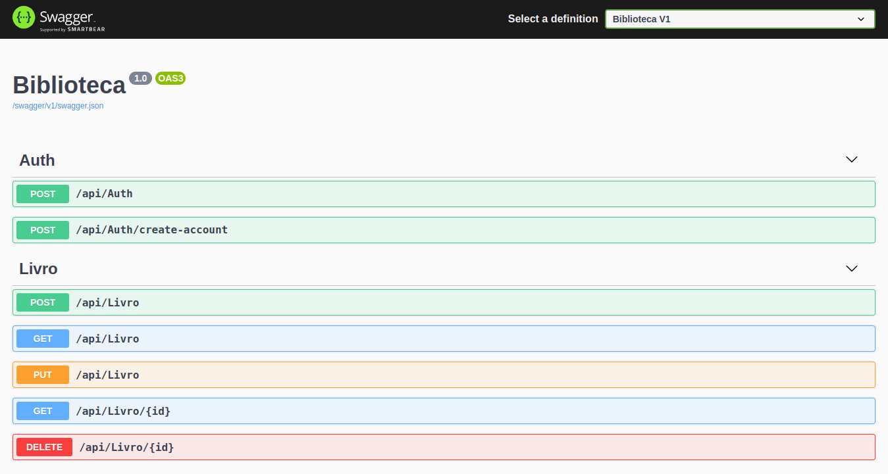
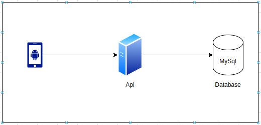

# CRUD Livros com App Mobile Android

Solução é composta por uma API feita em Dotnet Core, uma base SQL (MySql), Nginx, e um App Android.

A API fornece uma interface para um CRUD de livros de uma bibliteca, integrado com o banco de dados. E App disponibizado para o usuário interagir com a aplicação.

Este video no YouTube mostra o funcionamento da aplicação:

## Endpoints API

## Diagrama

